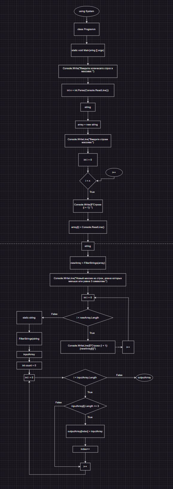

1. Программа сначала запрашивает у пользователя количество строк в массиве.
2. Затем пользователь должен ввести сами строки.
3. После этого программа вызывает функцию FilterStrings, которая формирует новый массив с помощью двух циклов: в первом цикле подсчитывается количество строк, длина которых меньше или равна 3 символам, а во втором цикле создается новый массив и копируются соответствующие строки.
4. Новый массив выводится на экран.

